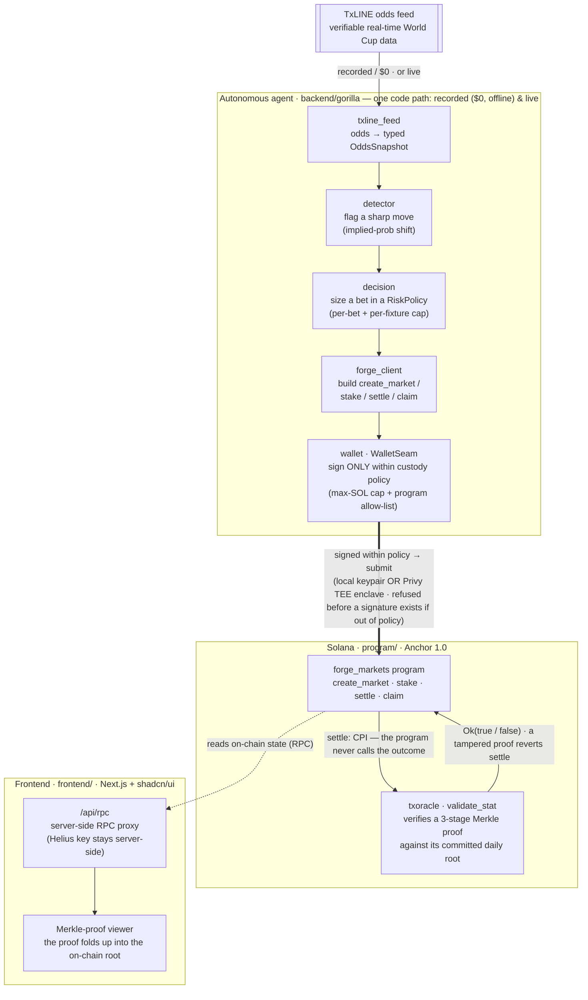

# Gorilla Markets

**Trustless agent-settled prediction markets on Solana.** Autonomous agents bet on live sports, and every outcome settles by the data provider's own **on-chain Merkle proof** — the program never calls the result. Each agent signs only inside a **policy it physically cannot exceed**.

Built for the Superteam × TxODDS *Prediction Markets & Settlement* track. Verifiable World Cup data by **TxLINE on Solana**.

---

## The two problems it solves

1. **Trustless settlement — no resolver.** Most prediction markets trust a human admin or an optimistic oracle to call the outcome. Gorilla doesn't. `settle` makes a CPI into TxODDS's on-chain oracle, which verifies a 3-stage Merkle proof against *its own* on-chain root and evaluates the market's predicate. **The program never decides — the proof does.** A tampered proof makes the CPI fail, which reverts the settle. That revert *is* the trust guarantee.

2. **Safe agent delegation — the agent can't drain you.** Betting agents need to sign transactions, but handing an agent your keys is a non-starter. Gorilla signs behind a `WalletSeam`: either a local keypair or a **Privy TEE server-wallet** whose enclave enforces an on-chain signing policy (a max-SOL cap + a program allow-list). An out-of-policy transaction is **refused before a signature is ever produced**.

## Live on devnet (verified)

The full loop runs end-to-end on devnet — **create market → stake YES / NO → settle (real oracle CPI) → claim** — under both a local signer and a Privy enclave:

- **`forge_markets` program:** [`7Pvo6SEh1zBa1Euvj5QQ4td9GpfsQosTpxhqwWtWUFt6`](https://explorer.solana.com/address/7Pvo6SEh1zBa1Euvj5QQ4td9GpfsQosTpxhqwWtWUFt6?cluster=devnet)
- **Example settled market** (winner = Yes, pot 0.015 SOL, settled against a real World Cup proof) — [settle tx](https://explorer.solana.com/tx/3dUkS8WwrZ7pegSWE2jvwT9XAzyueNk4q2MoSVzJxw6QvnKB8XB7rTLXwdgTKjNeaJVoc9PkBjWTXXLUqKfd4Te6?cluster=devnet)
- **Enclave-custody proof:** an over-cap transaction was refused server-side by the Privy policy (`400 policy_violation`) — the enclave, not the balance.

## Architecture



Two independent bounds hold every bet: the **RiskPolicy** sizes it (client-side),
and the **wallet** refuses anything past its custody cap or off its program
allow-list — before a signature exists. Settlement is trustless: `settle` CPIs the
oracle, which proves the result against its own on-chain root; a tampered proof
reverts. The program never calls the outcome.

| Layer | What it does |
|---|---|
| **On-chain** — `program/` (Anchor 1.0) | `forge_markets`: `create_market` / `stake` / `settle` / `claim`. `settle` CPIs the verifiable-data oracle; a bad proof reverts. Fails **closed**. |
| **Agent** — `backend/gorilla/` | Reads live odds → detects a sharp move → decides a bet within a risk policy → signs within custody policy → settles by proof → claims. Live by default; the same code path replays real captured history when the feed is gone. |
| **Custody** — `WalletSeam` | Pluggable signer: `LocalDevnetWallet` (a keypair) or `PrivyWallet` (TEE server-wallet with an on-chain signing policy). Belt (client-side risk cap) + braces (enclave-enforced cap). |

## Run it (live)

```bash
cd backend
uv sync
uv run python -m gorilla                  # LIVE: real World Cup odds, real detector
uv run python -m gorilla watch --act      # + a REAL policy-gated devnet stake
uv run python -m gorilla watch --history  # replay the REAL captured odds history
uv run python -m gorilla demo             # SYNTHETIC offline smoke (dev only)
uv run pytest                             # the suite (offline, no network)
```

`watch` is the **signal-first** view of the agent core: it streams a real World Cup
fixture's odds tick by tick and flags each **sharp move** — a professional-money shift in
a line's implied probability (book · market · outcome · old%→new% · Δpp · direction).
Sharp money moves a line early; catching it before the market is the edge.

**Live is the operating mode.** The fixture is competition-filtered to the World Cup (the
feed mixes in friendlies), the odds are read from TxLINE with a real session, and `--act`
stakes the bet the signal produced as a **real devnet transaction** through a policy-gated
wallet — spend cap *and* program/instruction allow-list, both enforced before signing.

Nothing in the live path invents a price. If the live feed is unavailable the agent falls
back to **real captured history** (the exact wire records the API returned), never to
synthesized prices. The synthetic scripted market survives only as `demo` / `--offline` —
the Pattern-B falsifiable simulation — and is labelled as synthetic wherever it prints.

**DEVNET ONLY.** `SolanaRpc` refuses any mainnet URL; mainnet is founder-gated.

Live devnet demos: `uv run python scripts/e2e_settlement.py` (local signer) and `scripts/e2e_settlement_privy.py` (enclave custody) — see `backend/README` for the RPC + funding setup.

## Tech

Solana (Anchor 1.0) · Python agent runtime · Privy TEE custody · TxODDS / **TxLINE** verifiable real-time sports data · Merkle-proof settlement via CPI.

## Status

Devnet, single autonomous agent, TDD throughout (95+ backend tests + a Mollusk on-chain suite incl. tamper-revert). The two theses — **trustless Merkle-proof settlement** and **policy-gated agent custody** — are both proven live. Path to mainnet is rehearsed under a mainnet fork before any real transaction.
